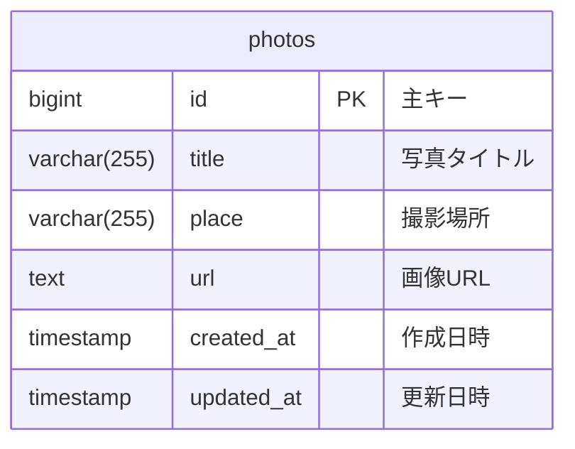

こんにちは！
今回の技能五輪も無事に終了して安心している[戸田](https://x.com/shuntemskills)です。

今回は第63回 技能五輪全国大会ウェブデザイン職種の問題を解いて私なりの解説をします。

:::details 自己紹介はこちら

## 軽く自己紹介

過去に技能五輪で日本代表として出場しました。
現在はIT系の企業でウェブアプリ開発の仕事をしています。

- 第59回 技能五輪全国大会ウェブデザイン職種 銀賞
- 第60回 技能五輪全国大会ウェブデザイン職種 金賞
- 第61回 技能五輪全国大会ウェブデザイン職種 金賞
- 第47回 技能五輪国際大会ウェブデザイン職種(WorldSkills2024 WebTechnologies) 出場


**第47回 技能五輪国際大会ウェブデザイン職種(WorldSkills2024 WebTechnologies)のブログ**

https://dev.classmethod.jp/articles/worldskills-lyon-2024-experience-report/
:::

## 技能五輪ウェブデザイン職種とは

### 技能五輪とは

技能五輪は、世界各国の若手エンジニアを育成するための大会です。
それぞれ機械組み立て、電気溶接、配管、和裁などの職種ごとで競技が行われます。

#### 公式サイト

https://worldskills.jp/nationalskills/

### 技能五輪ウェブデザイン職種とは

技能五輪ウェブデザイン職種とは、**ウェブアプリやウェブサイトを作成する技能**を競う職種です。
プログラミング言語の理解やデータベースの設計、デザインの理解などウェブに関わる技能の知識が必要です。

ウェブデザイン職種では4つの課題が配布されます。その課題の仕様通りに作業を行い提出します。
提出後、審査員が仕様通りに実装できているか客観的（一部主観）により採点が行われます。

## 第63回 技能五輪全国大会ウェブデザイン職種の課題

今大会では以下の課題がありました。

- M1 スピードテスト
- M2　バックエンド
- M3 フロントエンド
- M4 デザインレイアウト

この記事ではM2の課題を解説します。

**課題一覧はこちら↓**
https://www.javada.or.jp/jigyou/gino/zenkoku/n_63/kadai/39.html

## M2 バックエンド

ここからは課題の解説です。

**課題のリンク**

https://www.javada.or.jp/jigyou/gino/zenkoku/n_63/kadai/39/39_03_m2_20251028_bdlanbhslk.pdf

:::message
この実装だけが正解ではありません。様々な実装方法の中から適切な実装を選択できる力が技能五輪では求められます。
:::

### 概要
M2課題はPHPによるバックエンドをメインとしたウェブアプリケーションを作成する課題です。

PHPによるDB操作やAPI、管理画面の作成を行います。

今大会の課題は例年と比べると比較的簡単な課題でした。
今までの傾向や今後どのような対策をすればいいのかも記載しています。

### 主に利用する技術
- PHP 8.2
- Laravel 12 (一応CodeIgniter、Yiiも利用可能) 
- MySQL 8.0

### 実装の解説

ここからはLaravel 12を利用した実装の解説をします。

解説に利用する参考リポジトリ

https://github.com/ShuntaToda/gorin2025-m2-backend?tab=readme-ov-file


### 手順
まずは課題実装の全体の流れです。

1. データベース設計・構築
2. モデル作成
3. コントローラー作成
4. ルート定義
5. ビュー作成
6. API作成

### データベース設計・構築

まずデータベースの設計をします。
今回の課題では以下のようなデータベースを設計しました。



今回はかなり簡単なテーブル設計ですが、RDBのリレーションなどの概念は理解しておきましょう。
今後の大会でもリレーションに関わる課題が出題される可能性大です。
実際の業務では必須レベルの知識なので覚えておいて損はないでしょう。

続いてデータベースの構築です。

Laravelでは複数形のテーブルがある場合、単数系のモデルを作成することで自動的に複数形のテーブルを参照するようになります。

今回だとphotosというテーブル名なのでphotoという名前のモデルを作成します。

```bash
php artisan make:model Photo -m
```

ちなみに`-m`オプションを付けるとマイグレーションファイルも作成されます。
このようなオプションを覚えておくと素早くファイルを作成できるためオススメです。

マイグレーションファイルにはデータベースの設計に合わせてフィールドを定義します。

https://github.com/ShuntaToda/gorin2025-m2-backend/blob/a450d7a772cb29711654c130db13427b87d7d8a1/database/migrations/2025_10_17_065936_create_photos_table.php#L15-L36


### モデルの設定

次にモデルの設定です。

**Laravelのモデルについての説明はこちら**
https://readouble.com/laravel/12.x/ja/eloquent.html


先ほどのコマンドで作成したPhotoというモデルがあるのでこれを編集します。

https://github.com/ShuntaToda/gorin2025-m2-backend/blob/a450d7a772cb29711654c130db13427b87d7d8a1/app/Models/Photo.php#L1-L41

Laravelには色々なDBへのデータ操作を行うためのメソッドが用意されています。

今回は[createメソッド](https://qiita.com/tatsu_nomad/items/f2804c3ec563076ec5c5)を利用してデータを作成するので`$fillable`にデータを作成するフィールドを指定します。


これでデータベースとモデルの設定は完了です。

### マイグレーションの実施

ここで一度マイグレーションを実施してちゃんとDBにテーブルが作成できるか確認しましょう。

```bash
php artisan migrate
```

これでマイグレーションが実施されてテーブルが作成されます。

コマンド実行時に以下のようなログが出力されればマイグレーションが成功しています。

```
INFO  Preparing database.  

Creating migration table ....................... 5.35ms DONE

INFO  Running migrations.  
2025_10_17_065936_create_photos_table .......... 0.63ms DONE
```

https://readouble.com/laravel/12.x/ja/migrations.html

### コントローラーの作成

次にコントローラーの作成です。

コントローラーはデータベースのデータを取得したり、データを作成したりするためのものです。

https://readouble.com/laravel/12.x/ja/controllers.html

このコマンドでコントローラーが作成されます。

```bash
php artisan make:controller PhotoController
```


### 機能の実装

ここからは具体的な機能の実装を解説します。

### 機能1-1写真一覧表示

#### ルート定義

```
GET /admin/photos -> 写真一覧表示
```

https://github.com/ShuntaToda/gorin2025-m2-backend/blob/a450d7a772cb29711654c130db13427b87d7d8a1/routes/web.php#L26-L27

`->name('index')`はルートに名前を付けるためのオプションです。
後で `route('admin.photos.index')` のようにこのルート名を参照して、URLを動的に生成できます。これにより、ルートが変わってもコード内の参照箇所を修正する必要がなくなります。

https://qiita.com/tamakiiii/items/f474c79a9e50ddc59f06

#### コントローラー（index メソッド）

https://github.com/ShuntaToda/gorin2025-m2-backend/blob/a450d7a772cb29711654c130db13427b87d7d8a1/app/Http/Controllers/AdminPhotoController.php#L20-L27

`index` メソッドはデータベースから全ての写真を取得して表示します。`created_at` カラムの値が降順（新しい順）に並べ替えた全ての写真を取得し、ビューに渡します。

`compact('photos')`は`$photos` 変数をビューに渡すヘルパー関数です。`['photos' => $photos']` と同じ意味ですが、より簡潔に書けます。

https://qiita.com/yastinbieber/items/0c7b23ac382ac8afdb0e

#### ビュー（一覧表示テンプレート）

https://github.com/ShuntaToda/gorin2025-m2-backend/blob/a450d7a772cb29711654c130db13427b87d7d8a1/resources/views/admin/photos/index.blade.php#L1-L152

写真一覧を表示するビューです。以下の機能を実装しています：

- **メッセージ表示**
  - セッションに保存された成功/エラーメッセージを表示
- **新規登録ボタン**
  - `route()` ヘルパーで新規登録フォームへのリンクを生成
  - `route('admin.photos.create')` のように名前付きルートからURLを生成します
- **データ表示**
  - `@foreach` ループでデータベースから取得した写真情報を表示
  - `@foreach` は Blade（Laravel のテンプレートエンジン）の制御構造です
  - [参考ドキュメント](https://readouble.com/laravel/12.x/ja/frontend.html#:~:text=PHP%E3%81%AE%E4%BD%BF%E7%94%A8-,PHP%E3%81%A8Blade,-%E4%BB%A5%E5%89%8D%E3%80%81%E3%81%BB%E3%81%A8%E3%82%93%E3%81%A9%E3%81%AE)
- **編集・削除ボタン**
  - 各行に編集ボタンと削除ボタンを配置
- **XSS対策**
  - 二重中括弧 `{{ }}` で自動的にHTMLエスケープ
  - `{{ $photo->title }}` のように書くと、HTMLの特殊文字が自動的にエスケープされます
  - [参考ドキュメント](https://readouble.com/laravel/12.x/ja/blade.html#:~:text=%E7%B4%A0%E6%99%B4%E3%82%89%E3%81%97%E3%81%84%E3%82%A2%E3%83%97%E3%83%AD%E3%83%BC%E3%83%81%E3%81%A7%E3%81%99%E3%80%82-,%E3%83%87%E3%83%BC%E3%82%BF%E3%81%AE%E8%A1%A8%E7%A4%BA,-%E5%A4%89%E6%95%B0%E3%82%92%E4%B8%AD)
- **削除確認**
  - `onclick="return confirm()"` でダイアログを表示
  - これはJavaScriptの機能


### 機能1-2写真新規作成フォーム表示

#### ルート定義

```
GET /admin/photos/create -> 新規登録フォーム表示
```

https://github.com/ShuntaToda/gorin2025-m2-backend/blob/a450d7a772cb29711654c130db13427b87d7d8a1/routes/web.php#L29-L30

#### コントローラー（create メソッド）

https://github.com/ShuntaToda/gorin2025-m2-backend/blob/a450d7a772cb29711654c130db13427b87d7d8a1/app/Http/Controllers/AdminPhotoController.php#L34-L38

`create` メソッドは新規登録用のフォームを表示するだけです。

#### ビュー（新規登録フォームテンプレート）

https://github.com/ShuntaToda/gorin2025-m2-backend/blob/a450d7a772cb29711654c130db13427b87d7d8a1/resources/views/admin/photos/create.blade.php#L1-L132

新規登録用のフォームです。

- **入力フィールド**
  - title, place, url, created_at
- **datetime-local型**
  - `created_at` は日時ピッカーで入力
- **old() ヘルパー**
  - バリデーションエラー時に入力値を復元
  - `old('title')` でフォーム送信時に入力した値を取得し、エラーがあった場合に値を復元します
  - これによりユーザーが再度すべてを入力する手間が削減されます
  - [参考ドキュメント](https://readouble.com/laravel/12.x/ja/validation.html#:~:text=%40enderror%22%3E-,%E3%83%95%E3%82%A9%E3%83%BC%E3%83%A0%E3%81%AE%E5%86%8D%E5%8F%96%E5%BE%97,-Laravel%E3%81%8C%E3%83%90%E3%83%AA%E3%83%87%E3%83%BC%E3%82%B7%E3%83%A7%E3%83%B3)
- **CSRF保護**
  - `@csrf` トークンの埋め込み
  - `@csrf` は CSRF（クロスサイトリクエストフォージェリ）攻撃から保護するトークンを生成します
  - POST、PUT、DELETE などの状態を変更するリクエストには必須です
  - [参考ドキュメント](https://readouble.com/laravel/12.x/ja/csrf.html)


### 機能1-3写真新規登録処理

#### ルート定義

```
POST /admin/photos -> 新規登録処理
```

https://github.com/ShuntaToda/gorin2025-m2-backend/blob/a450d7a772cb29711654c130db13427b87d7d8a1/routes/web.php#L32-L33

#### コントローラー（store メソッド）

https://github.com/ShuntaToda/gorin2025-m2-backend/blob/a450d7a772cb29711654c130db13427b87d7d8a1/app/Http/Controllers/AdminPhotoController.php#L45-L67

`store` メソッドは、フォームから送信されたデータをバリデーション（検証）した後、データベースに保存する時に使います。

- **`$request->validate()`**
  - フォームデータをバリデーション（検証）します
  - 検証ルールに合致しない場合は自動的に前のページにリダイレクトされ、エラーメッセージが表示されます
  - [参考ドキュメント](https://readouble.com/laravel/12.x/ja/validation.html)
- **`redirect()->route()`**
  - 指定したルート名にリダイレクトします
  - [参考ドキュメント](https://readouble.com/laravel/12.x/ja/redirects.html?header=%25E3%2583%25AA%25E3%2583%2580%25E3%2582%25A4%25E3%2583%25AC%25E3%2582%25AF%25E3%2583%2588%25E3%2581%25AE%25E4%25BD%259C%25E6%2588%2590)
- **`->with('success', ...)`**
  - セッションに成功メッセージを一時保存します
  - リダイレクト先で `session('success')` で取得できます
  - [参考ドキュメント](https://readouble.com/laravel/12.x/ja/session.html)
- **`back()`**
  - 前のページにリダイレクト
- **`->withInput()`**
  - フォーム送信時の入力値をセッションに保存し、リダイレクト先で復元できるようにします

**バリデーションルール**:
- `title`: 必須、最大255文字
- `place`: 必須、最大255文字
- `url`: 必須
- `created_at`: 必須、日付形式

**セキュリティ対策**:
- `$validated` で検証済みのデータのみを使用（ホワイトリスト方式）
- `try-catch` ブロックでエラーハンドリング
- SQLインジェクション対策は Eloquent ORM が対応

#### ビュー（新規登録フォームテンプレート）

機能1-2と同じフォームテンプレート（`create.blade.php`）を使用します。


### 機能1-4写真編集フォーム表示

#### ルート定義

```
GET /admin/photos/{id}/edit -> 編集フォーム表示
```

https://github.com/ShuntaToda/gorin2025-m2-backend/blob/a450d7a772cb29711654c130db13427b87d7d8a1/routes/web.php#L35-L36

`{id}`はルートパラメータです。URL内の変動部分を表します。例：`/admin/photos/1/edit` の場合、`$id = 1` となります。

#### コントローラー（edit メソッド）

https://github.com/ShuntaToda/gorin2025-m2-backend/blob/a450d7a772cb29711654c130db13427b87d7d8a1/app/Http/Controllers/AdminPhotoController.php#L74-L81

`edit` メソッドは指定されたID の写真情報を取得して編集フォームに渡します。

`findOrFail($id)`は指定した ID のレコードを取得します。見つからない場合は自動的に 404 エラーページを表示します。

#### ビュー（編集フォームテンプレート）

https://github.com/ShuntaToda/gorin2025-m2-backend/blob/a450d7a772cb29711654c130db13427b87d7d8a1/resources/views/admin/photos/edit.blade.php#L1-L135

編集用のフォームです。

- **プリフィル**
  - `old('created_at', $photo->created_at')` で既存値を表示
  - バリデーションエラーがある場合は `old()` の値を優先、なければ既存の写真情報を表示
- **PUTメソッド**
  - `@method('PUT')` で更新処理を指定
  - HTMLフォームは GET と POST のみ対応するため、`@method('PUT')` で疑似的に PUT メソッドを指定します
- **日時フォーマット**
  - `\Carbon\Carbon::parse()->format()` で日時を正しい形式に変換
  - datetime-local 型は `YYYY-MM-DDTHH:MM` 形式が必須のため、Carbon で変換します
- **CSRF保護**
  - `@csrf` トークンの埋め込み


### 機能1-5写真情報更新処理

#### ルート定義

```
PUT /admin/photos/{id} -> 更新処理
```

https://github.com/ShuntaToda/gorin2025-m2-backend/blob/a450d7a772cb29711654c130db13427b87d7d8a1/routes/web.php#L38-L39

#### コントローラー（update メソッド）

https://github.com/ShuntaToda/gorin2025-m2-backend/blob/a450d7a772cb29711654c130db13427b87d7d8a1/app/Http/Controllers/AdminPhotoController.php#L88-L113

`update` メソッドは、編集フォームから送信されたデータでレコードを更新します。

`->update($validated)`はモデルを更新します。検証済みのデータを渡すことで、安全に更新できます。

#### ビュー（編集フォームテンプレート）

機能1-4と同じ編集フォームテンプレート（`edit.blade.php`）を使用します。

### 機能1-6写真情報削除処理

#### ルート定義

```
DELETE /admin/photos/{id} -> 削除処理
```

https://github.com/ShuntaToda/gorin2025-m2-backend/blob/a450d7a772cb29711654c130db13427b87d7d8a1/routes/web.php#L41-L42

#### コントローラー（destroy メソッド）

https://github.com/ShuntaToda/gorin2025-m2-backend/blob/a450d7a772cb29711654c130db13427b87d7d8a1/app/Http/Controllers/AdminPhotoController.php#L120-L136

`destroy` メソッドはレコードを削除します。

`->delete()`は対応するレコードをデータベースから削除します。

#### ビュー（一覧表示テンプレート）

https://github.com/ShuntaToda/gorin2025-m2-backend/blob/a450d7a772cb29711654c130db13427b87d7d8a1/resources/views/admin/photos/index.blade.php#L132-L139

一覧表示ビューに削除ボタンを配置します。削除ボタンをクリックすると確認ダイアログが表示され、「OK」を選択すると DELETE メソッドでサーバに削除リクエストを送信します。

- **確認ダイアログ**
  - `onclick="return confirm()"` で削除前に確認
- **CSRF保護**
  - `@csrf` トークン
- **メソッド指定**
  - `@method('DELETE')` で DELETE メソッドを指定


### 機能2-1写真一覧取得API

#### ルート定義

```
GET /api/photos -> 写真一覧をタイトルと撮影場所で返す
```

https://github.com/ShuntaToda/gorin2025-m2-backend/blob/a450d7a772cb29711654c130db13427b87d7d8a1/routes/api.php#L14-L15

#### コントローラー（index メソッド）

https://github.com/ShuntaToda/gorin2025-m2-backend/blob/a450d7a772cb29711654c130db13427b87d7d8a1/app/Http/Controllers/ApiPhotoController.php#L21-L33

タイトルと撮影場所のみを返すエンドポイント。`select()` メソッドで必要なカラムのみを選択することで、パフォーマンスが向上します。

- **`->select('title', 'place')`**
  - 必要なカラムのみを取得する SQL の SELECT 句を指定します
  - 不要なカラムを除外することで、メモリ使用量とクエリ時間を削減できます
  - [参考ドキュメント](https://readouble.com/laravel/12.x/ja/queries.html?header=DELETE#:~:text=Specifying%20a%20Select%20Clause)
- **`response()->json()`**
  - データを JSON 形式でレスポンスとして返します
  - 第2引数はHTTPステータスコード（200 = 成功）です

#### レスポンス例

APIはクライアント側で呼び出されるため、ビューは不要です。レスポンスは JSON 形式です。

```json
[
  {
    "title": "商業施設外観",
    "place": "渋谷センター街"
  },
  {
    "title": "フードコート風景",
    "place": "新宿駅前"
  }
]
```

**HTTPステータスコード**:
- 成功時: 200 (OK)
- エラー時: 404 (Not Found)


### 機能2-2写真詳細情報取得API

#### ルート定義

```
GET /api/photos/{id}.json -> 指定ID の写真の全メタデータを返す
```

https://github.com/ShuntaToda/gorin2025-m2-backend/blob/a450d7a772cb29711654c130db13427b87d7d8a1/routes/api.php#L18-L20

重要なポイント：エンドポイント `/api/photos/{id}.json` には `.json` という拡張子が必須です。

#### コントローラー（show メソッド）

https://github.com/ShuntaToda/gorin2025-m2-backend/blob/a450d7a772cb29711654c130db13427b87d7d8a1/app/Http/Controllers/ApiPhotoController.php#L41-L63

指定 ID の写真の全情報を返すエンドポイント。配列形式で必要なデータのみを構築してから返すことで、API の仕様を厳密に守ります。

#### レスポンス例

```json
{
  "title": "商業施設外観",
  "place": "渋谷センター街",
  "url": "https://example.com/images/photo1.jpg",
  "created_at": "2025-10-17T12:34:56.000000Z",
  "updated_at": "2025-10-17T12:34:56.000000Z"
}
```

**HTTPステータスコード**:
- 成功時: 200 (OK)
- エラー時: 404 (Not Found)


### 機能3メタデータの追加

#### 概要

案内用画面から写真の解像度、ファイルサイズ、MIME タイプを取得できるようにするため、データベーススキーマを拡張します。

#### マイグレーション（ルート定義の代わり）

https://github.com/ShuntaToda/gorin2025-m2-backend/blob/a450d7a772cb29711654c130db13427b87d7d8a1/SQL/2025_10_17_072534_add_metadata_to_photos_table.php#L20-L38

以下の 4 つのカラムを追加します：

```php
$table->integer('width')->nullable()->comment('画像の幅(px)');
$table->integer('height')->nullable()->comment('画像の高さ(px)');
$table->bigInteger('file_size')->nullable()->comment('ファイルサイズ(bytes)');
$table->string('mime_type', 100)->nullable()->comment('MIMEタイプ（例：image/jpeg）');
```

#### 実装手順

```bash
# マイグレーションファイルの作成
php artisan make:migration add_metadata_to_photos_table

# SQL ディレクトリに移動
# マイグレーションファイルを SQL ディレクトリにコピー

# マイグレーション実行
php artisan migrate
```

これでM2バックエンド課題の解説は終了です。

## まとめ

Laravelを使えるようになるにはMVCアーキテクチャやデータベースの設計、APIの作成など様々な知識が必要になります。
これを習得すると大会だけでなく今後の業務にも大きく役立つと思います。
この解説を読んで勉強できたら次は自分が作りたいアプリを作っていっぱい遊んでみましょう！